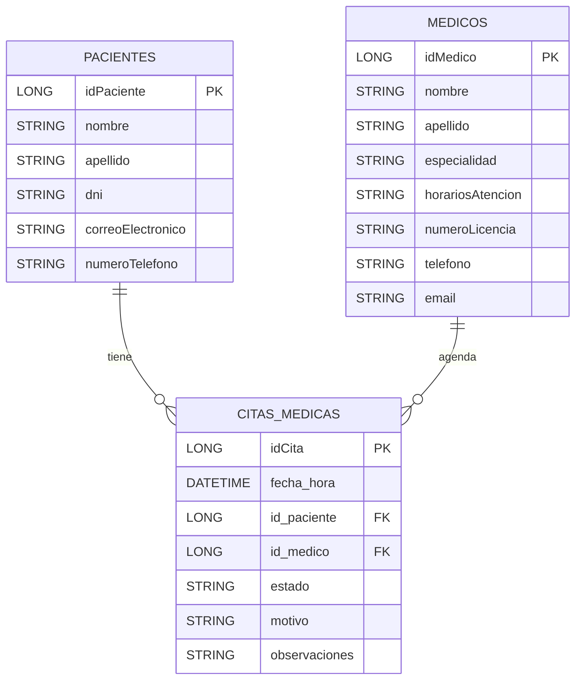

# Diagrama Entidad-Relación (DER)

Se incluye diagrama en formato Mermaid para visualizar las entidades principales y sus relaciones (PK, FK).

Notas:
- La tabla `citas_medicas` contiene una restricción UNIQUE sobre `(id_medico, fecha_hora)` para evitar doble reserva exacta de un mismo horario.
- Se usan claves foráneas `id_paciente` -> `pacientes.idPaciente` y `id_medico` -> `medicos.idMedico` para asegurar integridad referencial.

Puedes renderizar este diagrama en GitHub/GitLab que soporten Mermaid o usar un visualizador Mermaid local.
